# Agent-OS Subagent Integration Summary

## Overview

The agent-os instructions have been enhanced to be fully aware and compliant with the **SmugMug Photo Discovery Subagent**. All AI agents working with this codebase will now automatically integrate with and enforce the project's architecture standards.

## Enhanced Files

### **Core Instructions Enhanced**

1. **`.agent-os/instructions/meta/pre-flight.md`** (v1.1)
   - Added mandatory subagent activation requirements
   - Integrated critical architecture enforcement rules
   - Added subagent activation patterns and quality validation commands

2. **`.agent-os/instructions/core/execute-task.md`** 
   - Added Step 3: Architecture Compliance Pre-Check (SmugMugPhotoDiscoverySubagent)
   - Added Step 7: Post-Implementation Architecture Validation (SmugMugPhotoDiscoverySubagent)
   - Enhanced execution flow with continuous compliance monitoring
   - Renumbered all subsequent steps to accommodate subagent integration

3. **`.agent-os/instructions/meta/post-flight.md`** (v1.1)
   - Added mandatory final subagent validation
   - Included comprehensive architecture compliance checking
   - Added failure protocols and report generation requirements

### **New Core Instructions Created**

4. **`.agent-os/instructions/core/subagent-integration.md`** (NEW)
   - Comprehensive subagent integration guide for AI agents
   - Mandatory activation protocols and workflow integration
   - Error handling and recovery procedures
   - Success metrics and monitoring requirements

### **Standards Enhanced**

5. **`.agent-os/instructions/core/code-quality-gates.md`** (v1.1)
   - Enhanced with subagent integration requirements
   - Added agent-native compliance quality gates  
   - Updated code generation templates with subagent patterns
   - Enhanced automation scripts with primary subagent validation

6. **`.agent-os/standards/architecture-smells.md`** (v1.1)
   - Added subagent integration and automatic enforcement
   - Enhanced all critical smell categories with subagent enforcement labels
   - Added CS006: Missing Agent Integration smell category
   - Updated detection methods to prioritize subagent validation
   - Enhanced monitoring and measurement with subagent capabilities

## Key Integration Features

### **🤖 Mandatory Subagent Activation**
```bash
# Before any code generation
@SmugMugPhotoDiscoverySubagent validate planned architecture for [FEATURE]

# During development
node activate-subagent.cjs test

# After implementation  
node activate-subagent.cjs test --comprehensive
```

### **🚨 Automatic Architecture Enforcement**
The subagent now automatically enforces:
- Component size limits (≤200 lines)
- Hook complexity limits (≤3 dependencies per useEffect)
- Type safety requirements (zero `any` types)
- Memory leak prevention (required cleanup functions)
- Performance optimization (mandatory memoization)
- Agent-native compliance (useDualInterface + AgentWrapper)

### **📋 Enhanced Quality Gates**
All code generation now includes:
1. **Pre-implementation validation** (Step 3 in execute-task.md)
2. **Real-time compliance monitoring** during development
3. **Post-implementation verification** (Step 7 in execute-task.md)
4. **Final validation** in post-flight checks

### **🔄 Continuous Integration**
- Subagent validation integrated into all instruction workflows
- Automated compliance checking in pre-commit and post-flight
- Real-time architecture violation detection and prevention
- Agent-native feature enforcement for dual-interface architecture

## Workflow Integration

### **Enhanced Task Execution Flow**

```mermaid
graph TD
    A[Task Understanding] --> B[Technical Spec Review]
    B --> C[🤖 Architecture Compliance Pre-Check]
    C --> D[Best Practices Review]
    D --> E[Code Style Review]
    E --> F[Task Execution with Compliance Monitoring]
    F --> G[🤖 Post-Implementation Architecture Validation]
    G --> H[Test Verification]
    H --> I[Task Status Updates]
    I --> J[🤖 Final Subagent Validation]
```


### **Quality Gate Integration**


## Activation Keywords

AI agents can activate the subagent using any of these keywords:
- `@SmugMugPhotoDiscoverySubagent`
- `@PhotoDiscoveryGuardian`
- `@ArchitectureEnforcer`

## Compliance Requirements

### **Mandatory for ALL Code Generation**
- [ ] Subagent activated before implementation planning
- [ ] Architecture compliance validated during development
- [ ] Agent-native features included in all interactive components
- [ ] Performance optimization applied per subagent requirements
- [ ] Memory management enforced with proper cleanup
- [ ] Type safety maintained with explicit interfaces
- [ ] Final validation passed before task completion

### **Agent-Native Features Required**
- [ ] `useDualInterface` hook for state exposure
- [ ] `AgentWrapper` component for structured data
- [ ] Schema.org markup for agent discovery
- [ ] Action registry integration for programmatic access
- [ ] Natural language command support patterns

## Success Metrics

### **Integration KPIs**
- **Subagent Activation Rate**: 100% of code generation tasks
- **Architecture Compliance**: Zero violations in final validation
- **Agent Integration Coverage**: All interactive components agent-ready
- **Performance Standards**: Sub-100ms renders, proper memoization
- **Type Safety**: Zero `any` types in production code

### **Quality Improvements**
- **Automated Architecture Enforcement**: Real-time violation prevention
- **Consistent Code Quality**: Subagent pattern compliance
- **Agent-Native Compatibility**: Dual-interface architecture
- **Performance Optimization**: Automatic memoization compliance
- **Memory Safety**: Enforced cleanup and AbortController usage

## Future Enhancements

The enhanced agent-os system is designed to:
- Continuously enforce architecture standards
- Automatically integrate agent-native capabilities  
- Provide real-time feedback and fix suggestions
- Scale with additional subagent capabilities
- Support multi-agent development workflows

---

## Quick Reference

### **For AI Development Tools**
```bash
# Activate subagent validation
@SmugMugPhotoDiscoverySubagent validate this component

# Check compliance status
node activate-subagent.cjs test

# Get subagent configuration
node activate-subagent.cjs config
```

### **Integration Status**
- ✅ Pre-flight instructions enhanced
- ✅ Task execution workflow integrated
- ✅ Post-flight validation added
- ✅ Quality gates enhanced
- ✅ Architecture standards updated
- ✅ Subagent integration guide created
- ✅ All files tested and validated

**The agent-os system is now fully subagent-compliant and ready to enforce world-class architecture standards for all AI-assisted development.**