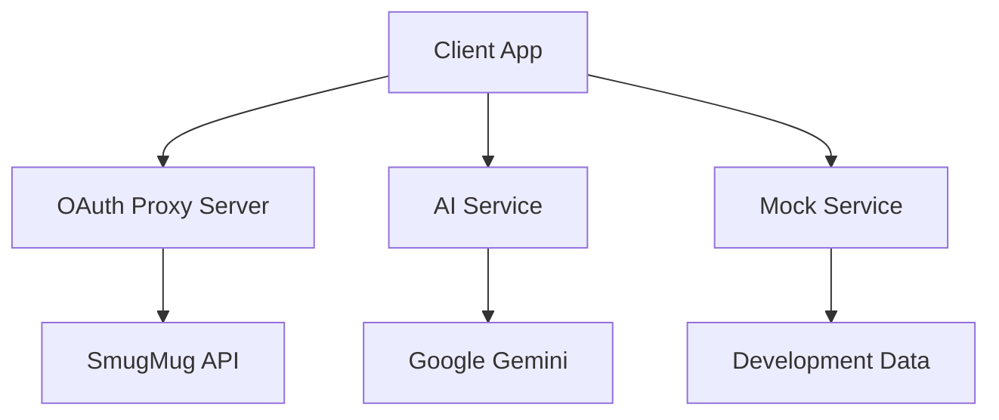

# SmugMug API Reference

Welcome to the comprehensive SmugMug API integration guide! This documentation will help you build robust applications using the SmugMug API with OAuth 1.0a authentication and AI-powered features.

## What You'll Learn

🚀 **[Quick Start](./getting-started/quick-start)** - Get running in 5 minutes  
🔐 **[OAuth 1.0a Implementation](./oauth-implementation/oauth-overview)** - Secure authentication  
🤖 **[AI Integration](./ai-integration/ai-overview)** - Intelligent photo management  
📚 **[Complete API Reference](./api-reference/authentication)** - All endpoints and patterns  

## Why This Guide?

This isn't just documentation—it's a **complete reference implementation** showing:

- ✅ **Production-ready patterns** for OAuth 1.0a authentication
- ✅ **AI integration examples** with Google Gemini
- ✅ **Performance optimization** techniques with measurable results  
- ✅ **Security best practices** for API integration
- ✅ **Real code examples** you can copy and adapt

## Architecture Overview

## Quick Navigation

import DocCardList from '@theme/DocCardList';

<DocCardList />