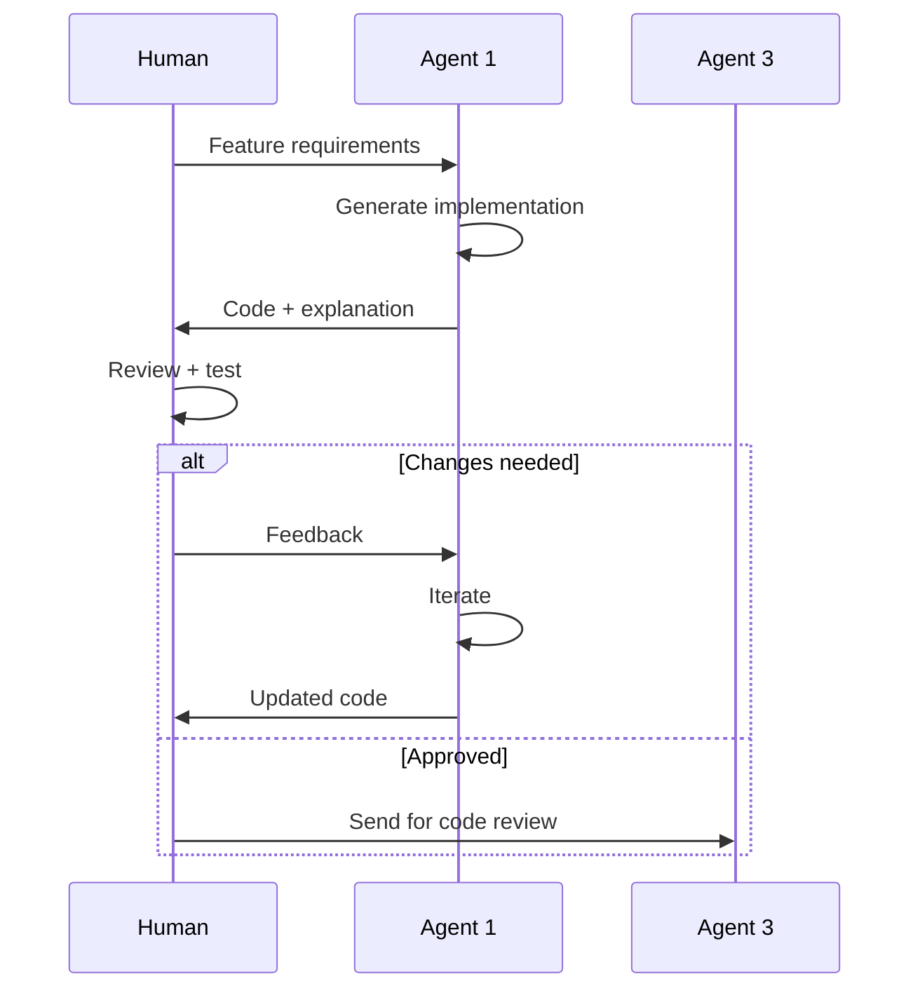
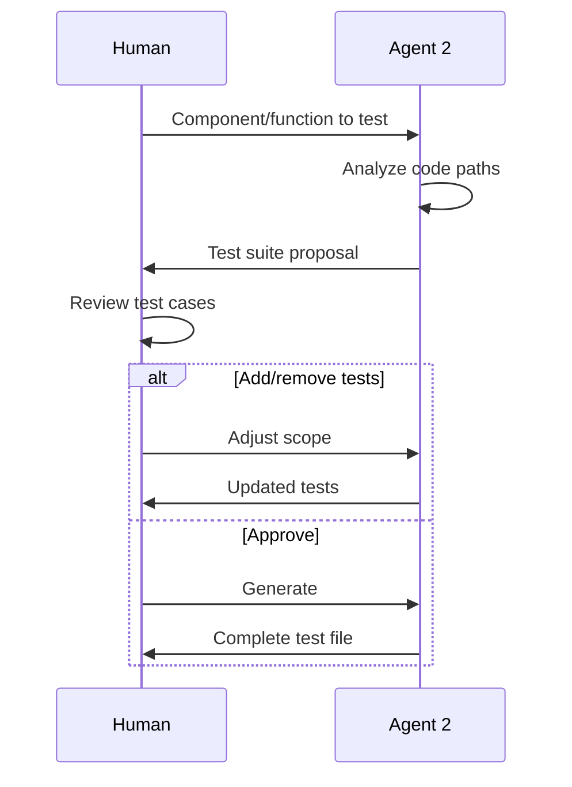
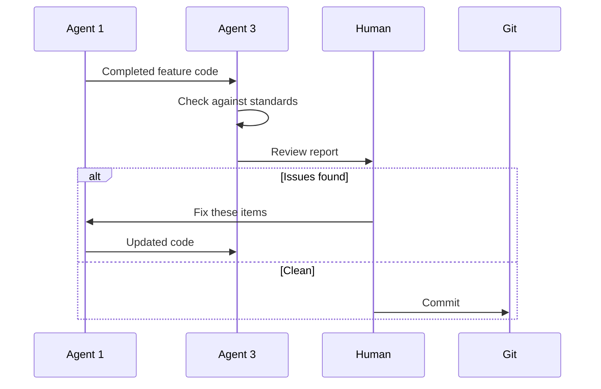
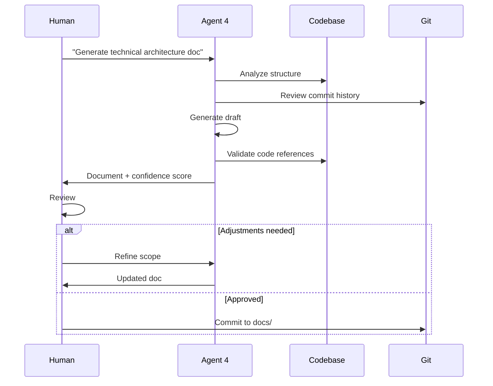
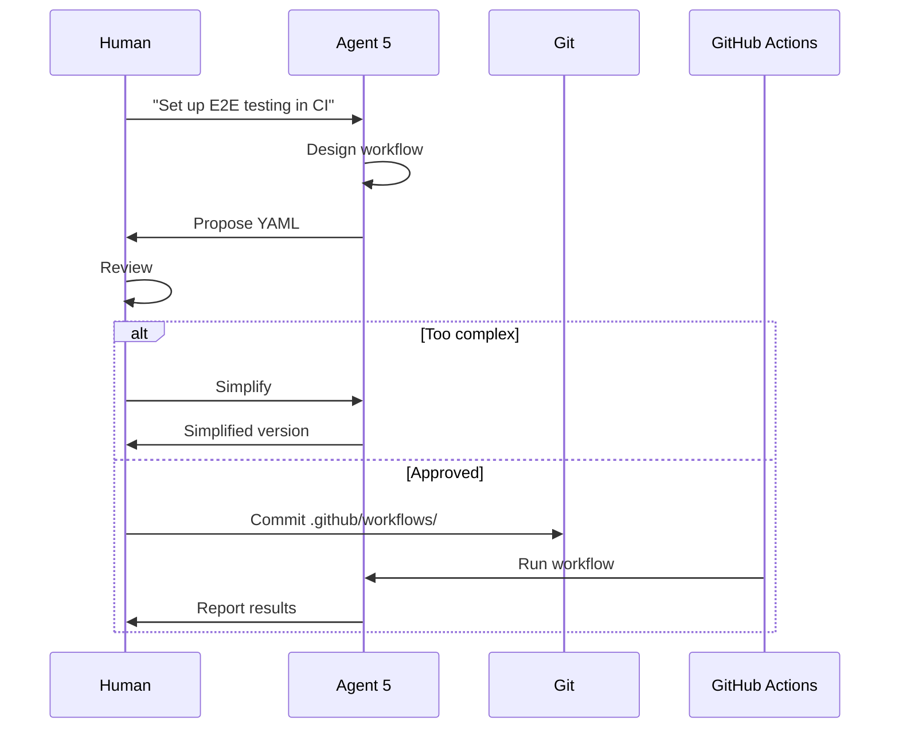

# Agent Team Architecture

**Building a Virtual Development Team with AI Agents**

---

## Overview

This document describes the **agent orchestration workflow** used to build the SmugMug API Reference Application. It's a blueprint for solo developers who want to leverage AI agents as a virtual team.

**Key Concept:** Treat AI agents as specialized team members, not glorified autocomplete.

---

## Table of Contents

1. [Team Structure](#team-structure)
2. [Agent Roles & Capabilities](#agent-roles--capabilities)
3. [Communication Patterns](#communication-patterns)
4. [Workflow Orchestration](#workflow-orchestration)
5. [Quality Gates](#quality-gates)
6. [Tooling & Setup](#tooling--setup)
7. [Reusable Prompt Templates](#reusable-prompt-templates)
8. [Anti-Patterns to Avoid](#anti-patterns-to-avoid)

---

## Team Structure

### Organizational Chart

```
┌─────────────────────────────────────┐
│   Human Developer (You)             │
│   Role: Architect & Orchestrator    │
└──────────────┬──────────────────────┘
               │
     ┌─────────┼─────────┬──────────┬──────────┐
     │         │         │          │          │
┌────▼────┐ ┌─▼────┐ ┌──▼─────┐ ┌──▼─────┐ ┌─▼──────┐
│Agent 1  │ │Agent │ │Agent 3 │ │Agent 4 │ │Agent 5 │
│Feature  │ │  2   │ │Code    │ │Docs    │ │DevOps  │
│Builder  │ │Test  │ │Quality │ │        │ │        │
└─────────┘ └──────┘ └────────┘ └────────┘ └────────┘
```

### Team Composition

| Agent | Role | Equivalent Human Role | Utilization |
|-------|------|---------------------|-------------|
| **Agent 1** | Feature Builder | Senior Full-Stack Dev | 60% |
| **Agent 2** | Testing Specialist | QA Engineer | 20% |
| **Agent 3** | Code Quality Enforcer | Tech Lead / Reviewer | 10% |
| **Agent 4** | Documentation | Technical Writer | 15% |
| **Agent 5** | DevOps | DevOps Engineer | 10% |
| **Human** | Architect / PM | CTO / Product Manager | 100% |

**Note:** Percentages = time spent managing each agent

---

## Agent Roles & Capabilities

### Agent 1: Feature Builder

**Platform:** Claude Sonnet 4.5
**Context Window:** 200K tokens
**Prompt Caching:** Enabled

**Responsibilities:**
- Implement new features from requirements
- Build React components
- API integrations
- State management
- Business logic

**Strengths:**
- Fast implementation (5-10x human speed for boilerplate)
- Pattern recognition (learns project conventions)
- Handles complexity well (multi-file changes)

**Limitations:**
- Over-engineers if unconstrained
- Needs explicit UI/UX guidance
- Can miss edge cases in business logic

**Typical Workflow:**



**Configuration:**
```
System Prompt:
"You are a senior React/TypeScript developer.
Write production-quality code following these standards:
- TypeScript strict mode
- Functional components with hooks
- Tailwind CSS for styling
- Max 250 lines per component
- Self-documenting code (minimal comments)
Prioritize simplicity over cleverness."
```

---

### Agent 2: Testing Specialist

**Platform:** Claude Sonnet 4.5
**Specialty:** Vitest, Playwright, Testing Library

**Responsibilities:**
- Write unit tests
- Write E2E tests
- Create test fixtures
- Build testing infrastructure
- Identify edge cases

**Strengths:**
- Exhaustive test coverage
- Catches edge cases humans miss
- Fast test generation (10-20 tests in minutes)

**Limitations:**
- Sometimes writes redundant tests
- Can be overly verbose
- Needs guidance on priority

**Typical Workflow:**



**Configuration:**
```
System Prompt:
"You are a QA engineer specializing in JavaScript testing.
Write tests using:
- Vitest for unit tests
- Playwright for E2E tests
- @testing-library/react for component tests

Test philosophy:
- Focus on behavior, not implementation
- Test user-facing functionality
- Cover happy path + 2-3 edge cases
- Avoid testing framework internals
Keep test files under 300 lines."
```

---

### Agent 3: Code Quality Enforcer

**Platform:** Claude Sonnet 4.5
**Specialty:** Code review, architecture, patterns

**Responsibilities:**
- Review code for best practices
- Enforce architectural patterns
- Suggest refactoring
- Catch anti-patterns
- Ensure consistency

**Strengths:**
- Instant feedback (vs. waiting for human reviewer)
- Comprehensive checks (TypeScript, React rules, accessibility)
- Remembers project standards

**Limitations:**
- Can be pedantic
- Sometimes suggests unnecessary abstraction
- Needs context on "good enough"

**Typical Workflow:**



**Configuration:**
```
System Prompt:
"You are a technical lead reviewing code.
Check for:
1. TypeScript strict mode compliance
2. React hooks rules (ESLint react-hooks)
3. Component composition (no prop drilling)
4. Accessibility (ARIA labels, keyboard nav)
5. Performance anti-patterns

Be pragmatic:
- Flag critical issues only
- Suggest improvements, don't require perfection
- Prioritize readability over cleverness"
```

---

### Agent 4: Documentation (Docu-Agent)

**Platform:** Claude Sonnet 4.5
**Specialty:** Technical writing, architecture analysis

**Responsibilities:**
- Generate technical documentation
- Write API references
- Create architecture diagrams
- Business impact analysis
- Self-validate against codebase

**Strengths:**
- Comprehensive output (78K words generated)
- Cross-references code automatically
- Mermaid diagram generation
- Self-audit capability

**Limitations:**
- Can be overly detailed
- Sometimes suggests enterprise features for simple projects
- Needs scope constraints

**Typical Workflow:**



**Configuration:**
```
System Prompt:
"You are Docu-Agent, a technical writer specializing in software documentation.

Your process:
1. Analyze codebase deeply
2. Generate comprehensive documentation
3. Self-validate all claims against source code
4. Provide confidence scores
5. Flag ambiguities

Output format:
- Markdown with mermaid diagrams
- Code references (file:line format)
- Confidence scores for each section
- Ambiguity reports for uncertain claims

Tone: Professional, concise, data-driven"
```

---

### Agent 5: DevOps

**Platform:** Claude Sonnet 4.5
**Specialty:** CI/CD, testing infrastructure, monitoring

**Responsibilities:**
- GitHub Actions workflows
- Build optimization
- Error detection frameworks
- Deployment automation
- Infrastructure as code (when applicable)

**Strengths:**
- Knows CI/CD best practices
- Comprehensive error handling
- Multi-format reporting

**Limitations:**
- Over-engineers pipelines
- Suggests expensive monitoring tools
- Needs budget constraints

**Typical Workflow:**



**Configuration:**
```
System Prompt:
"You are a DevOps engineer specializing in GitHub Actions and frontend CI/CD.

Constraints:
- Use free tier services when possible
- Keep workflows under 5 minutes
- Prefer simplicity over exhaustive checks
- Cache dependencies aggressively

Output:
- YAML workflow files
- Clear step names and comments
- Error handling for common failures
- Cost estimates for paid services"
```

---

## Communication Patterns

### Human ↔ Agent 1 (Feature Builder)

**Pattern: Requirements → Implementation → Iteration**

**Effective:**
```
Human: "Build PhotoCard.tsx:
- Display photo thumbnail, title, date
- Hover: show overlay with actions (view, delete)
- Click: open PhotoDetailModal
- Use Tailwind, max 200 lines
- Follow ImageGrid.tsx patterns"

Agent 1: [Generates 187-line component]