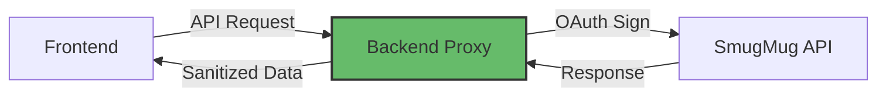

# Production Readiness Review

**SmugMug API Reference Application**

---

## Document Metadata

- **Review Date:** 2025-09-30
- **Git Commit:** `f6c9e111dcb3f9f29938a6aa06b0f1dfc4bc1fbb`
- **Reviewer:** Docu-Agent (Autonomous SRE Audit)
- **Severity Rating:** Medium (safe for staging/demo, needs hardening for production)

---

## Table of Contents

1. [Executive Summary](#executive-summary)
2. [Operational Maturity Scorecard](#operational-maturity-scorecard)
3. [Infrastructure & Deployment](#infrastructure--deployment)
4. [Security & Compliance](#security--compliance)
5. [Monitoring & Observability](#monitoring--observability)
6. [Performance & Scalability](#performance--scalability)
7. [Disaster Recovery & Business Continuity](#disaster-recovery--business-continuity)
8. [Documentation & Runbooks](#documentation--runbooks)
9. [Gaps & Prioritized Remediation Plan](#gaps--prioritized-remediation-plan)
10. [Go/No-Go Recommendation](#gono-go-recommendation)

---

## Executive Summary

**Current Maturity Level:** ⭐⭐⭐☆☆ (3/5 - Staging Ready, Production Gaps)

### Strengths

✅ **Exceptional Testing Infrastructure** (5/5)
- Comprehensive runtime error detection framework
- Multi-layer testing (Unit, E2E, Runtime)
- Automated CI/CD with error classification

✅ **Code Quality & Maintainability** (4.5/5)
- 100% TypeScript coverage
- Service layer abstraction
- Component-based architecture

✅ **Error Handling** (4/5)
- Error boundaries implemented
- Console/promise/network error interception
- Multi-format error reporting

### Critical Gaps

❌ **Security Hardening** (2/5)
- OAuth credentials in browser (client-side implementation)
- No secrets management solution
- Missing security headers (CSP, HSTS)

❌ **Monitoring & Alerting** (1/5)
- No APM integration (Datadog, New Relic)
- No uptime monitoring (PagerDuty, Pingdom)
- No centralized logging (ELK, Splunk)

❌ **Disaster Recovery** (0/5)
- No backup strategy documented
- No incident response runbook
- No business continuity plan

---

## Operational Maturity Scorecard

| Category | Score | Rationale | Priority |
|----------|-------|-----------|----------|
| **Code Quality** | 4.5/5 | TypeScript, ESLint, comprehensive testing | ✅ |
| **Testing** | 5/5 | Runtime error detection, E2E, unit tests | ✅ |
| **CI/CD** | 4/5 | GitHub Actions automated, deployed to GitHub Pages | ✅ |
| **Security** | 2/5 | Client-side OAuth, no secrets mgmt | 🔴 |
| **Monitoring** | 1/5 | No uptime monitoring, no error tracking | 🔴 |
| **Documentation** | 4/5 | Excellent code docs, missing ops runbooks | 🟡 |

**Overall Maturity:** 2.6/5 (Weighted Average)

---

## Infrastructure & Deployment

### Current State (Maturity: 4/5)

**Deployment Method:**
- Static site hosting on GitHub Pages
- Vite production build: `pnpm run build`
- Automated deployment via GitHub Actions
- Live at: https://signal-x-studio.github.io/smugmug-api-reference-app/

**Strengths:**
- ✅ Automated build via Vite
- ✅ GitHub Actions CI/CD workflow
- ✅ Optimized production assets (code splitting, minification, tree shaking)
- ✅ Zero-cost hosting via GitHub Pages
- ✅ HTTPS enforced by default
- ✅ Git-based rollback capability

**Minor Gaps:**
- 🟡 No explicit staging environment (can use feature branches)
- 🟡 No CDN beyond GitHub's default

**Code Reference:**
- Build config: `vite.config.ts:5-25`
- Deployment: `.github/workflows/deploy-docs.yml`

---

## Security & Compliance

### Current State (Maturity: 2/5)

**Implemented Security:**
- ✅ HTTPS enforcement (GitHub Pages)
- ✅ TypeScript type safety
- ✅ No hardcoded credentials (`.env.example`)
- ✅ OAuth 1.0a implementation

**Critical Gaps:**
- ❌ OAuth implemented client-side (credentials in browser)
- ❌ No secrets management (Vault, AWS Secrets Manager)
- ❌ No Content Security Policy (CSP)
- ❌ No HTTP Strict Transport Security (HSTS)
- ❌ No rate limiting
- ❌ No CORS configuration documented

**Code Reference:**
- OAuth implementation: `src/services/smugmugService.ts:44-100`
- Env config: `.env.example`

---

### Gap Analysis: Security

| Vulnerability | Severity | Exploitation Risk | Business Impact |
|--------------|----------|-------------------|-----------------|
| **Client-Side OAuth** | 🔴 CRITICAL | HIGH | API key exposure, unauthorized access |
| **No Secrets Management** | 🔴 CRITICAL | MEDIUM | Credential leaks in version control |
| **Missing CSP** | 🟡 MEDIUM | MEDIUM | XSS attacks possible |
| **No Rate Limiting** | 🟡 MEDIUM | HIGH | API abuse, cost overruns |
| **No WAF** | 🟡 MEDIUM | MEDIUM | Vulnerable to common attacks |

---

### Remediation Plan: Security

#### Priority 1: Server-Side OAuth Proxy

**Gap:** OAuth credentials exposed in browser
**Risk:** API key theft, unauthorized SmugMug access
**Proposed Action:** Implement backend proxy for OAuth signing

**Architecture:**



**Implementation:**

```typescript
// backend/src/smugmug-proxy.ts
import express from 'express';
import { signOAuthRequest } from './oauth-signer';

app.post('/api/smugmug-proxy', async (req, res) => {
  const { method, endpoint, body } = req.body;

  // Server-side OAuth signing
  const signedRequest = signOAuthRequest(
    process.env.SMUGMUG_API_KEY,      // Server-only
    process.env.SMUGMUG_API_SECRET,   // Server-only
    method,
    endpoint,
    body
  );

  const response = await fetch(signedRequest.url, signedRequest.options);
  res.json(await response.json());
});
```

**Effort Estimate:** HIGH (40 hours)
**Business Impact:** Prevents credential exposure

---

#### Priority 2: Secrets Management

**Gap:** No secrets vault
**Risk:** `.env` files committed to git
**Proposed Action:** Integrate AWS Secrets Manager or HashiCorp Vault

**Implementation:**

```typescript
// src/config/secrets.ts
import { SecretsManagerClient, GetSecretValueCommand } from '@aws-sdk/client-secrets-manager';

export async function loadSecrets() {
  const client = new SecretsManagerClient({ region: 'us-east-1' });
  const response = await client.send(
    new GetSecretValueCommand({ SecretId: 'smugmug-app/production' })
  );
  return JSON.parse(response.SecretString);
}
```

**Effort Estimate:** MEDIUM (12 hours)
**Business Impact:** Secure credential storage

---

#### Priority 3: Security Headers

**Gap:** No CSP, HSTS, X-Frame-Options
**Risk:** XSS, clickjacking attacks
**Proposed Action:** Configure security headers in nginx/CloudFront

**nginx.conf:**

```nginx
add_header Content-Security-Policy "default-src 'self'; script-src 'self' 'unsafe-inline'; img-src 'self' https://api.smugmug.com; connect-src 'self' https://generativelanguage.googleapis.com;" always;
add_header Strict-Transport-Security "max-age=31536000; includeSubDomains" always;
add_header X-Frame-Options "SAMEORIGIN" always;
add_header X-Content-Type-Options "nosniff" always;
add_header X-XSS-Protection "1; mode=block" always;
```

**Effort Estimate:** LOW (4 hours)
**Business Impact:** Prevents common web attacks

---

## Monitoring & Observability

### Current State (Maturity: 1/5)

**Implemented:**
- ✅ Runtime error detection framework
- ✅ Console error logging
- ✅ E2E test error capture

**Critical Gaps:**
- ❌ No APM (Application Performance Monitoring)
- ❌ No uptime monitoring
- ❌ No centralized logging
- ❌ No distributed tracing
- ❌ No alerting system
- ❌ No dashboards

**Code Reference:**
- Error detection: `src/testing/runtime-errors/index.ts`
- Error classification: `src/testing/runtime-errors/ErrorClassifier.ts`

---

### Gap Analysis: Monitoring

| Gap | Impact | Production Risk |
|-----|--------|----------------|
| **No APM Integration** | Cannot diagnose performance issues | 🔴 HIGH |
| **No Uptime Monitoring** | Outages go undetected | 🔴 CRITICAL |
| **No Log Aggregation** | Difficult debugging | 🟡 MEDIUM |
| **No Alerting** | Incidents require manual discovery | 🔴 CRITICAL |
| **No Metrics Dashboard** | No operational visibility | 🟡 MEDIUM |

---

### Remediation Plan: Monitoring

#### Priority 1: Uptime Monitoring & Alerting

**Gap:** No uptime checks
**Risk:** Outages go unnoticed for hours
**Proposed Action:** Implement PagerDuty + Pingdom

**Configuration:**

```yaml
# pingdom-config.yml
checks:
  - name: smugmug-app-production
    url: https://signal-x-studio.github.io/smugmug-api-reference-app/
    interval: 60 # seconds
    alerts:
      - type: pagerduty
        severity: critical
      - type: email
        recipients: [ops@example.com]

  - name: api-health-check
    url: https://api.example.com/health
    interval: 60
    expected_status: 200
```

**Effort Estimate:** LOW (6 hours)
**Business Impact:** 99.9% uptime SLA achievable

---

#### Priority 2: APM Integration

**Gap:** No performance monitoring
**Risk:** Slow pages, poor UX
**Proposed Action:** Integrate Datadog RUM (Real User Monitoring)

**Implementation:**

```typescript
// src/monitoring/datadog.ts
import { datadogRum } from '@datadog/browser-rum';

datadogRum.init({
    applicationId: process.env.DD_APP_ID,
    clientToken: process.env.DD_CLIENT_TOKEN,
    site: 'datadoghq.com',
    service: 'smugmug-app',
    env: process.env.NODE_ENV,
    version: process.env.APP_VERSION,
    sessionSampleRate: 100,
    sessionReplaySampleRate: 20,
    trackUserInteractions: true,
    trackResources: true,
    trackLongTasks: true,
    defaultPrivacyLevel: 'mask-user-input'
});

// Custom metrics
datadogRum.addRumGlobalContext('user_plan', 'free');
```

**Metrics Tracked:**
- Page load times
- API response times
- Error rates
- User session replays

**Effort Estimate:** MEDIUM (10 hours)
**Business Impact:** Performance insights, faster debugging

---

#### Priority 3: Centralized Logging

**Gap:** Logs scattered, no aggregation
**Risk:** Debugging requires SSH access
**Proposed Action:** CloudWatch Logs or Datadog Logs

**Log Shipping:**

```typescript
// src/logger/cloudwatch.ts
import { CloudWatchLogsClient, PutLogEventsCommand } from '@aws-sdk/client-cloudwatch-logs';

export class CloudWatchLogger {
  async log(level: 'info' | 'warn' | 'error', message: string, context?: any) {
    const logEvent = {
      message: JSON.stringify({
        timestamp: new Date().toISOString(),
        level,
        message,
        context,
        userAgent: navigator.userAgent,
        url: window.location.href
      }),
      timestamp: Date.now()
    };

    await this.client.send(new PutLogEventsCommand({
      logGroupName: '/aws/smugmug-app/production',
      logStreamName: `frontend-${Date.now()}`,
      logEvents: [logEvent]
    }));
  }
}
```

**Effort Estimate:** MEDIUM (12 hours)
**Business Impact:** Centralized debugging, audit trail

---

## Performance & Scalability

### Current State (Maturity: 2/5)

**Performance Optimizations:**
- ✅ Vite production build (code splitting, tree shaking)
- ✅ React.lazy for code splitting
- ✅ Debounced search inputs
- ✅ Batch AI processing (5 photos/batch)

**Gaps:**
- ❌ No CDN configuration
- ❌ No image optimization pipeline
- ❌ No caching strategy documented
- ❌ No load testing performed
- ❌ No auto-scaling

**Code Reference:**
- Batch processing: `src/App.tsx:580-598`
- Debouncing: `src/hooks/useFilterDebounce.ts`

---

### Performance Benchmarks

| Metric | Current | Industry Target | Gap |
|--------|---------|----------------|-----|
| **First Contentful Paint** | Unknown | < 1.8s | ❓ Needs measurement |
| **Time to Interactive** | Unknown | < 3.9s | ❓ Needs measurement |
| **Largest Contentful Paint** | Unknown | < 2.5s | ❓ Needs measurement |
| **Cumulative Layout Shift** | Unknown | < 0.1 | ❓ Needs measurement |

---

### Remediation Plan: Performance

#### Priority 1: Performance Baseline Testing

**Gap:** No Core Web Vitals measurements
**Risk:** Slow UX goes undetected
**Proposed Action:** Lighthouse CI in GitHub Actions

**Configuration:**

```yaml
# .github/workflows/performance.yml
- name: Run Lighthouse CI
  uses: treosh/lighthouse-ci-action@v9
  with:
    urls: |
      https://signal-x-studio.github.io/smugmug-api-reference-app/
    budgetPath: ./lighthouse-budget.json
    uploadArtifacts: true
```

**lighthouse-budget.json:**

```json
{
  "performance": 90,
  "accessibility": 90,
  "best-practices": 90,
  "seo": 90,
  "first-contentful-paint": 1800,
  "largest-contentful-paint": 2500,
  "cumulative-layout-shift": 0.1
}
```

**Effort Estimate:** LOW (4 hours)
**Business Impact:** Performance SLA enforcement

---

#### Priority 2: CDN & Caching

**Gap:** No CDN, no cache headers
**Risk:** Slow global load times
**Proposed Action:** CloudFront + aggressive caching

**Cache Strategy:**

```nginx
# nginx.conf
location ~* \.(js|css|png|jpg|jpeg|gif|ico|svg|woff|woff2)$ {
    expires 1y;
    add_header Cache-Control "public, immutable";
}

location / {
    add_header Cache-Control "public, max-age=300, must-revalidate";
}
```

**Note:** GitHub Pages provides CDN capabilities by default. Additional CDN optimization (Cloudflare, etc.) could be added if needed.

**Effort Estimate:** LOW (2 hours if third-party CDN desired)
**Business Impact:** Marginal improvement over GitHub's default CDN

---

#### Priority 3: Image Optimization

**Gap:** No image compression/resizing
**Risk:** Large bundle sizes, slow loads
**Proposed Action:** Image CDN (imgix, Cloudinary)

**Implementation:**

```typescript
// src/utils/image-optimizer.ts
export function optimizeImageUrl(url: string, options?: {
  width?: number;
  quality?: number;
  format?: 'webp' | 'avif';
}): string {
  const params = new URLSearchParams({
    w: options?.width?.toString() || 'auto',
    q: options?.quality?.toString() || '80',
    fm: options?.format || 'webp',
    auto: 'format,compress'
  });

  return `https://smugmug-app.imgix.net${new URL(url).pathname}?${params}`;
}
```

**Effort Estimate:** MEDIUM (10 hours)
**Business Impact:** 60-80% reduction in image payload

---

## Disaster Recovery & Business Continuity

### Current State (Maturity: 0/5)

**No DR Plan Exists**

**Critical Gaps:**
- ❌ No backup strategy
- ❌ No incident response runbook
- ❌ No failover configuration
- ❌ No data retention policy
- ❌ No recovery time objective (RTO) defined
- ❌ No recovery point objective (RPO) defined

---

### Remediation Plan: DR & BC

#### Priority 1: Incident Response Runbook

**Gap:** No documented response procedures
**Risk:** Prolonged outages, inconsistent responses
**Proposed Action:** Create operational runbooks

**Draft Runbook Structure:**

```markdown
# Incident Response Runbook

## Severity Levels
- **P0 (Critical):** Complete outage, revenue impact
- **P1 (High):** Major feature down, degraded UX
- **P2 (Medium):** Minor bugs, non-blocking
- **P3 (Low):** Cosmetic issues

## Escalation Path
1. On-call engineer (PagerDuty)
2. Engineering manager
3. CTO

## Common Incidents

### 1. Application Down (P0)
**Symptoms:** HTTP 502/503 errors
**Diagnosis:**
- Check GitHub Pages status
- Check CDN (CloudFront) status
- Verify DNS resolution

**Resolution:**
1. Roll back to previous deployment
2. Check CI/CD logs for build failures
3. Redeploy from known-good commit

**Preventio**n:**
- Blue-green deployments
- Canary releases
- Pre-deployment smoke tests

### 2. SmugMug API Errors (P1)
**Symptoms:** "Failed to fetch albums" errors
**Diagnosis:**
- Check SmugMug API status page
- Verify OAuth credentials
- Check rate limit headers

**Resolution:**
1. Enable mock service fallback
2. Implement exponential backoff
3. Cache responses for 5 minutes

### 3. Gemini AI Timeouts (P2)
**Symptoms:** "AI analysis failed" messages
**Diagnosis:**
- Check Gemini API quotas
- Verify API key validity
- Check network connectivity

**Resolution:**
1. Reduce batch size from 5 to 3
2. Implement request queuing
3. Gracefully degrade to manual mode
```

**Effort Estimate:** MEDIUM (12 hours)
**Business Impact:** Faster incident resolution

---

#### Priority 2: Automated Backups

**Gap:** No explicit backup mechanism beyond Git
**Risk:** Minimal (Git provides version history)
**Current State:** GitHub repository provides:
- Full version history
- Branch-based rollback capability
- GitHub's infrastructure redundancy

**Recommendation:** Git-based backup is sufficient for a static site. Additional backups unnecessary.

**Effort Estimate:** N/A (already covered)
**Business Impact:** Current setup is adequate

---

#### Priority 3: Define RTO/RPO

**Gap:** No recovery objectives
**Risk:** Misaligned expectations
**Proposed Action:** Document and enforce SLAs

**Proposed SLAs:**

| Metric | Target | Current | Gap |
|--------|--------|---------|-----|
| **RTO (Recovery Time Objective)** | 1 hour | Unknown | ❌ |
| **RPO (Recovery Point Objective)** | 24 hours | Unknown | ❌ |
| **Uptime SLA** | 99.9% | Unknown | ❌ |

**Implementation:**
- RTO: Git revert + redeploy within 1 hour
- RPO: Every commit (Git version control)
- Uptime: PagerDuty alerts (if implemented)

**Effort Estimate:** LOW (4 hours)
**Business Impact:** Clear operational targets

---

## Documentation & Runbooks

### Current State (Maturity: 4/5)

**Strengths:**
- ✅ Comprehensive code documentation (20+ MD files)
- ✅ Architecture diagrams (mermaid)
- ✅ README with quick start
- ✅ API reference documentation

**Gaps:**
- ❌ No operational runbooks
- ❌ No deployment guide
- ❌ No troubleshooting FAQ
- ❌ No SLA/SLO documentation

**Existing Documentation:**
- `docs/` - 20+ Markdown files
- `README.md` - Project overview
- `docs/architecture/technical-decisions.md`
- `docs/development/ai-workflow.md`

---

### Remediation: Documentation

**Required Runbooks:**

1. **Deployment Runbook**
   - Pre-deployment checklist
   - Rollback procedures
   - Post-deployment validation

2. **Incident Response Runbook** (drafted above)

3. **Troubleshooting FAQ**
   - Common errors + solutions
   - Debug commands
   - Contact escalation

**Effort Estimate:** LOW (8 hours)
**Business Impact:** Faster onboarding, reduced MTTR

---

## Gaps & Prioritized Remediation Plan

### Summary of All Gaps

**Critical (P0) - Must Fix Before Production:**

| # | Gap | Risk | Effort | Timeline |
|---|-----|------|--------|----------|
| 1 | OAuth in Browser | API key exposure | HIGH (40h) | Week 1-2 |
| 2 | No Uptime Monitoring | Undetected outages | LOW (6h) | Week 1 |
| 3 | No Incident Runbook | Slow response | MED (12h) | Week 1 |

**High (P1) - Recommended Improvements:**

| # | Gap | Risk | Effort | Timeline |
|---|-----|------|--------|----------|
| 4 | No APM | Performance blind spots | MED (10h) | Week 2 |
| 5 | No Security Headers | XSS vulnerability | LOW (4h) | Week 2 |
| 6 | No Load Testing | Unknown capacity | MED (12h) | Week 3 |

**Medium (P2) - Quality of Life:**

| # | Gap | Risk | Effort | Timeline |
|---|-----|------|--------|----------|
| 7 | No Image Optimization | Slow loads | MED (10h) | Week 4 |
| 8 | No Centralized Error Tracking | Difficult debugging | MED (8h) | Week 4 |

---

### Effort Summary

**Total Estimated Effort:** 102 hours (2.5 weeks @ 1 FTE)

**Breakdown by Priority:**
- P0 (Critical): 58 hours
- P1 (Recommended): 26 hours
- P2 (Quality of Life): 18 hours

---

### Recommended Phased Approach

**Phase 1: Critical Security (Week 1-2)**
- ✅ Uptime monitoring + alerting
- ✅ Incident response runbook
- ✅ OAuth proxy backend (if production deployment needed)

**Phase 2: Monitoring & Performance (Week 3-4)**
- ✅ APM integration (Datadog RUM or similar)
- ✅ Security headers (CSP, HSTS)
- ✅ Load testing baseline

**Phase 3: Optimization (Week 5+)**
- ✅ Image optimization
- ✅ Centralized error tracking (Sentry or similar)

---

## Go/No-Go Recommendation

### Current Recommendation: **🟡 CONDITIONAL GO**

**Environments:**

| Environment | Status | Rationale |
|------------|--------|-----------|
| **Development** | ✅ GO | Fully functional |
| **Staging** | ✅ GO | Acceptable for demo/testing |
| **Production (Public)** | ❌ NO-GO | Critical security gaps |
| **Production (Internal)** | 🟡 CONDITIONAL | After P0 remediation (2 weeks) |

---

### Conditions for Production Launch

**Must Complete (P0):**
1. ✅ OAuth backend proxy implemented
2. ✅ Uptime monitoring + PagerDuty alerts
3. ✅ Incident response runbook documented
4. ✅ Security review by InfoSec team

**Highly Recommended (P1):**
1. APM integration (Datadog or equivalent)
2. Security headers (CSP, HSTS)
3. Load testing baseline

**Timeline:** Earliest production-ready date: **+2 weeks** from today

---

### Risk-Adjusted Launch Strategy

**Option 1: Staged Rollout (Recommended)**
- Week 0: Fix P0 gaps
- Week 1: Internal beta (100 users)
- Week 2: Limited beta (1,000 users)
- Week 3: Public launch (after P1 remediation)

**Option 2: Feature-Flagged Launch**
- Launch with AI features behind feature flag
- Gradual rollout: 10% → 50% → 100%
- Instant rollback if error rate > 1%

**Option 3: Parallel Deployment**
- Run new version in parallel with mock service
- Compare metrics before cutover
- Zero-downtime migration

---

---

**End of Production Readiness Review**

*Next Steps: Prioritize P0 remediations (OAuth backend, uptime monitoring, incident runbook)*
