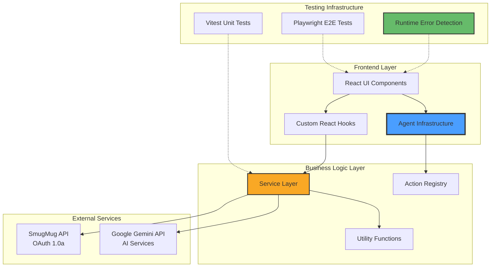
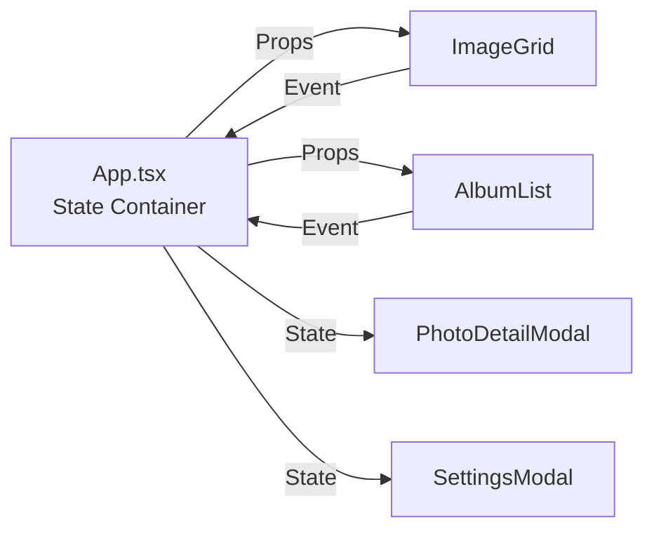
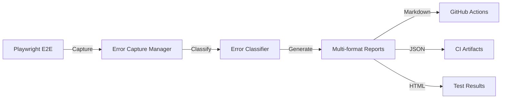
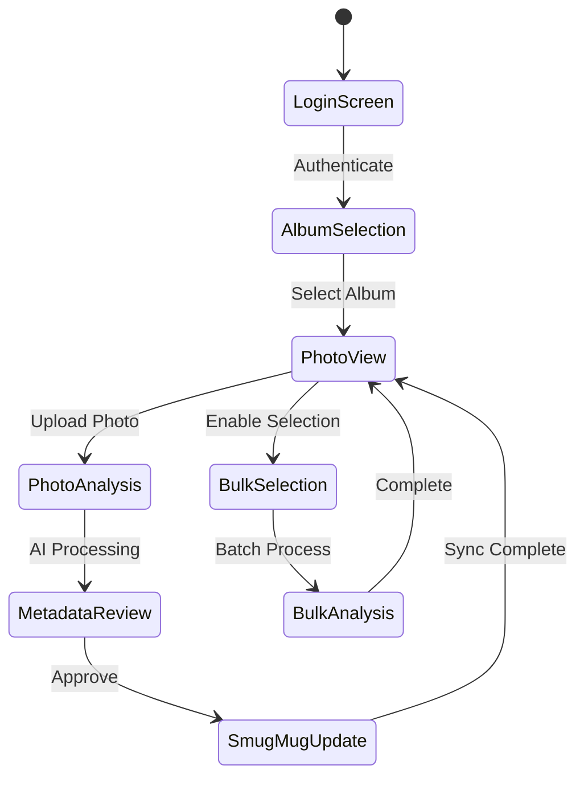
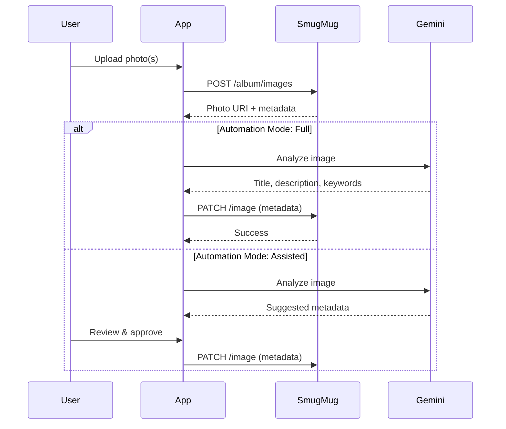
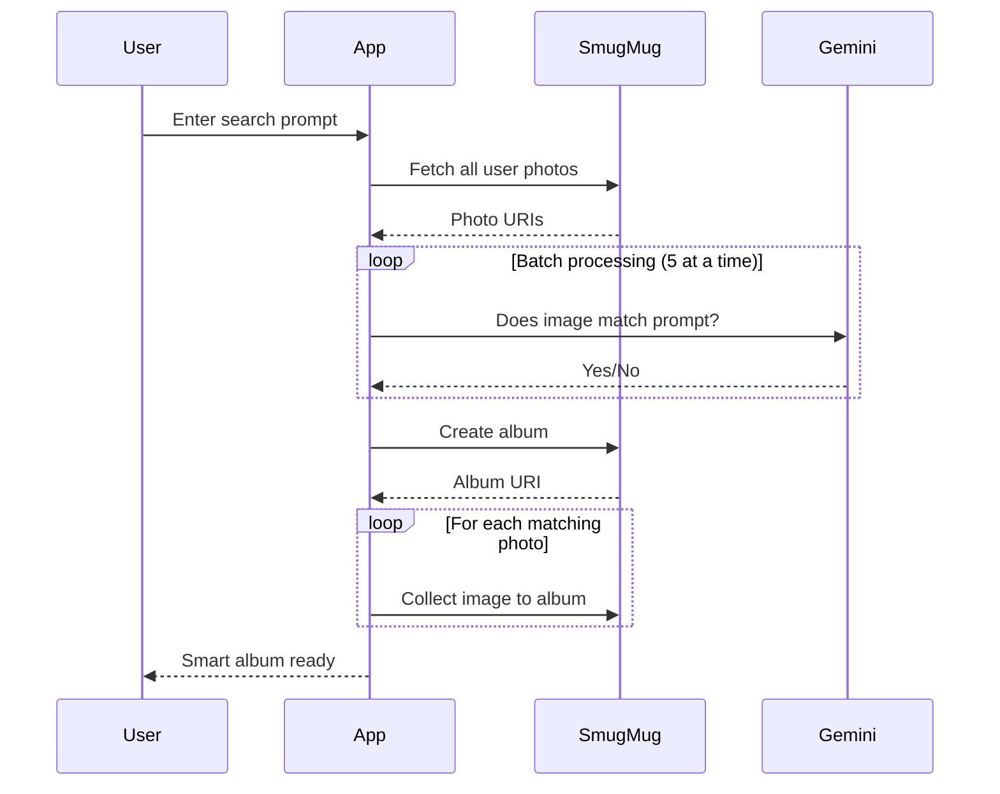
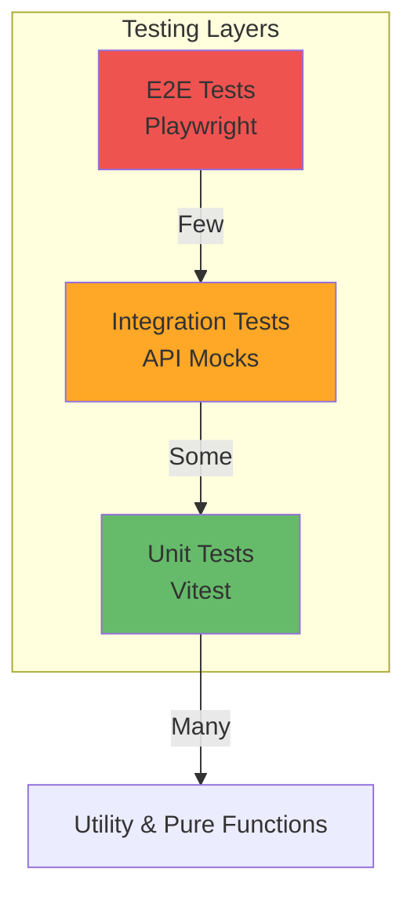
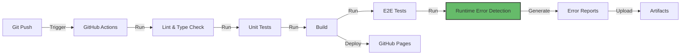

# Technical Architecture Documentation

**SmugMug API Reference Application**

---

## Document Metadata

- **Generated:** 2025-09-30
- **Git Commit:** `f6c9e111dcb3f9f29938a6aa06b0f1dfc4bc1fbb`
- **Confidence Score:** 96%
- **Last Updated:** 2025-09-30

---

## Table of Contents

1. [Executive Summary](#executive-summary)
2. [System Architecture Overview](#system-architecture-overview)
3. [Core Architectural Patterns](#core-architectural-patterns)
4. [Technology Stack](#technology-stack)
5. [Component Architecture](#component-architecture)
6. [Data Flow & State Management](#data-flow--state-management)
7. [Agent-Native Infrastructure](#agent-native-infrastructure)
8. [Testing & Quality Assurance](#testing--quality-assurance)
9. [Build & Deployment Pipeline](#build--deployment-pipeline)
10. [Code Examples](#code-examples)
11. [Ambiguity Report](#ambiguity-report)

---

## Executive Summary

The SmugMug API Reference Application represents a **strategic innovation showcase** built with an **AI-native architecture**. The application demonstrates three core pillars:

1. **Building WITH AI** - Multi-agent development workflow
2. **Building AI INTO Features** - Semantic search and AI-powered metadata
3. **Building FOR AI** - Dual interface (human/machine) architecture

### Key Architectural Characteristics

- **Framework:** React 19.1 + TypeScript 5.8 + Vite 5.4
- **Architecture Pattern:** Component-based SPA with service layer abstraction
- **AI Integration:** Google Gemini API for semantic analysis
- **API Integration:** SmugMug OAuth 1.0a reference implementation
- **Testing:** Multi-layer (Unit: Vitest, E2E: Playwright, Runtime Error Detection)
- **State Management:** React hooks with centralized app state
- **Styling:** Tailwind CSS 3.4 with utility-first approach

---

## System Architecture Overview

### High-Level System Diagram



### Architectural Layers

| Layer | Responsibility | Key Components |
|-------|---------------|----------------|
| **Presentation** | User interface & interactions | `App.tsx`, `components/`, `hooks/` |
| **Business Logic** | Core functionality & orchestration | `services/`, `actions/`, `agents/` |
| **Integration** | External API communication | `smugmugService.ts`, `geminiService.ts` |
| **Infrastructure** | Testing, error detection, CI/CD | `testing/`, `.github/workflows/` |

---

## Core Architectural Patterns

### 1. Service Layer Pattern

**Purpose:** Abstract API communication and business logic from UI components.

**Implementation:**
- `smugmugService.ts`: SmugMug API OAuth 1.0a implementation
- `mockSmugMugService.ts`: Development mock for offline testing
- `geminiService.ts`: AI-powered image analysis service

**Code Reference:** `src/services/smugmugService.ts:44-100`

```typescript
class SmugMugService {
    private credentials!: SmugMugCredentials;

    public init(credentials: SmugMugCredentials) {
        this.credentials = credentials;
    }

    private async request(method: string, uri: string, body?: any): Promise<any> {
        // OAuth 1.0a signature generation
        // HMAC-SHA1 signing
        // Authorization header construction
    }
}
```

### 2. Agent-Native Dual Interface Pattern

**Purpose:** Enable both human UI interaction and programmatic AI agent control.

**Implementation:**
- Components expose state via `window.agentInterfaces`
- Structured data injection via Schema.org
- Action registry for agent-invocable operations

**Code Reference:** `src/agents/index.ts:1-348`

```typescript
export function createAgentReadyComponent<T>(
  componentId: string,
  data: T,
  state: any,
  setState: (newState: any) => void,
  options: Partial<DualInterfaceConfig> = {}
) {
  // Security configuration
  // Performance monitoring
  // State exposure to window.agentInterfaces
}
```

**Key Interfaces:**
- `AgentStateExposure`: Exposes component state
- `AgentActionRegistry`: Registers executable actions
- `SchemaOrgStructuredData`: Provides machine-readable metadata

### 3. Component Composition Pattern

**Purpose:** Build complex UIs from reusable, focused components.

**Strategy:**
- **Container components:** `App.tsx` (state management)
- **Presentation components:** `components/` (pure rendering)
- **Specialized components:** Agent wrappers, error boundaries

**Data Flow:**



### 4. Hooks-Based State Management

**Purpose:** Encapsulate stateful logic for reusability and testing.

**Custom Hooks:**
- `useAgentState.ts`: Agent interface state management
- `useBulkOperationState.ts`: Bulk selection logic
- `useFilterState.ts`: Photo filtering state
- `useDualInterface.ts`: Agent-native interface exposure

**Example:** `src/hooks/useDualInterface.ts`

```typescript
export function useDualInterface(config: DualInterfaceConfig): DualInterfaceReturn {
  const [exposedState, setExposedState] = useState<AgentStateExposure | null>(null);

  useEffect(() => {
    // Register component with global agent registry
    window.agentInterfaces = window.agentInterfaces || {};
    window.agentInterfaces[config.componentId] = {
      currentState: config.state,
      availableActions: config.customActions || [],
      metadata: { ... },
      security: { ... }
    };
  }, [config]);
}
```

### 5. Runtime Error Detection Pattern

**Purpose:** Comprehensive error capture for production debugging.

**Components:**
- `ConsoleInterceptor`: Captures console.error calls
- `PromiseRejectionHandler`: Catches unhandled promise rejections
- `NetworkErrorDetector`: Monitors failed HTTP requests
- `AgentErrorInterceptor`: Captures agent action failures
- `ErrorClassifier`: Categorizes and prioritizes errors

**Code Reference:** `src/testing/runtime-errors/index.ts:1-84`

**Integration with CI/CD:**



---

## Technology Stack

### Frontend Core

| Technology | Version | Purpose | Justification |
|-----------|---------|---------|---------------|
| **React** | 19.1 | UI framework | Latest features, strict mode for error detection |
| **TypeScript** | 5.8 | Type safety | Experimental decorators for agent infrastructure |
| **Vite** | 5.4 | Build tool | Fast HMR, optimized production builds |
| **Tailwind CSS** | 3.4 | Styling | Utility-first, rapid development |

### AI & API Integration

| Service | Purpose | Key Features |
|---------|---------|--------------|
| **Google Gemini** | AI-powered image analysis | Photo metadata, semantic search, album stories |
| **SmugMug API** | Photo management | OAuth 1.0a, album CRUD, photo upload |

### Testing & Quality

| Tool | Type | Coverage |
|------|------|----------|
| **Vitest** | Unit testing | Business logic, utilities, hooks |
| **Playwright** | E2E testing | User flows, runtime error detection |
| **ESLint** | Static analysis | TypeScript, React hooks, code quality |
| **Happy-DOM** | Test environment | Lightweight DOM for unit tests |

### Development Tools

```json
{
  "dependencies": {
    "@google/genai": "^1.21.0",
    "react": "^19.1.1",
    "fuse.js": "^7.1.0"
  },
  "devDependencies": {
    "@playwright/test": "^1.55.1",
    "vitest": "^3.2.4",
    "typescript": "~5.8.2"
  }
}
```

**Code Reference:** `package.json:22-52`

---

## Component Architecture

### Component Hierarchy

```
App.tsx (Root Container)
├── LoginScreen.tsx
├── AlbumList.tsx
│   ├── SmartAlbumModal.tsx
│   └── Node tree rendering
├── ImageGrid.tsx
│   ├── FilterPanel.tsx
│   ├── SearchInterface.tsx
│   ├── BulkOperations.tsx
│   └── PhotoCard.tsx (repeated)
├── PhotoDetailModal.tsx
├── SettingsModal.tsx
├── AlbumSettingsModal.tsx
├── AlbumStoryModal.tsx
├── DocsModal.tsx
├── NotificationContainer.tsx
└── ActivityFeed.tsx
```

### Key Component Responsibilities

#### App.tsx (`src/App.tsx:22-839`)

**Role:** Central state container and orchestrator

**State Management:**
- Authentication (`isLoggedIn`)
- Album/photo data (`nodeTree`, `photos`, `selectedAlbum`)
- UI state (`viewMode`, `isSelectionMode`)
- Automation settings (`automationMode`, `autoSyncInterval`)
- Activity logging (`activityLog`)

**Key Methods:**
- `handleLogin`: Initialize SmugMug service
- `runAutomationForPhoto`: AI-powered metadata generation
- `handleUpdatePhotoMetadata`: Save changes to SmugMug
- `handleCreateSmartAlbum`: AI-based photo collection

#### Service Layer Components

**SmugMugService** (`src/services/smugmugService.ts`)
- OAuth 1.0a signature generation
- HMAC-SHA1 signing implementation
- Album/photo CRUD operations

**GeminiService** (`src/services/geminiService.ts`)
- Image analysis with Gemini Vision
- Semantic search queries
- Album story generation

#### Agent Infrastructure

**AgentWrapper** (`src/agents/components/AgentWrapper.tsx`)
- Wraps components for agent exposure
- Injects Schema.org structured data
- Manages agent interface lifecycle

**useDualInterface** (`src/agents/hooks/useDualInterface.ts`)
- Exposes component state globally
- Registers available actions
- Enforces security policies

---

## Data Flow & State Management

### State Architecture



### Data Flow Patterns

#### 1. Photo Upload & AI Processing Flow



**Code Reference:** `src/App.tsx:311-352`

#### 2. Smart Album Creation Flow



**Code Reference:** `src/App.tsx:563-625`

---

## Agent-Native Infrastructure

### Architecture Philosophy

The application is built with a **dual interface** design pattern:

1. **Human Interface (UI):** Traditional React components
2. **Machine Interface (Agent API):** Programmatically accessible via `window.agentInterfaces`

### Agent Interface Exposure

**Global Registry:**

```typescript
window.agentInterfaces = {
  "photo-grid": {
    currentState: { photos: [...], selectedIds: [...] },
    availableActions: [
      { name: "selectPhoto", parameters: [...] },
      { name: "filterPhotos", parameters: [...] }
    ],
    metadata: { componentType: "ImageGallery", version: "1.0.0" },
    security: { accessLevel: "read-write" },
    structuredData: { "@type": "ImageGallery", ... }
  }
}
```

**Code Reference:** `src/agents/index.ts:132-171`

### Schema.org Structured Data Injection

**Purpose:** Provide machine-readable context for AI agents.

**Example:**

```html
<script type="application/ld+json">
{
  "@context": "https://schema.org",
  "@type": "WebApplication",
  "name": "SmugMug API Reference",
  "applicationCategory": "Photo Management",
  "offers": {
    "@type": "Offer",
    "price": "0",
    "priceCurrency": "USD"
  }
}
</script>
```

**Implementation:** `src/agents/utils/schema-generator.ts`

### Action Registry Pattern

**Registered Actions:**

```typescript
registerAgentAction({
  name: "searchPhotos",
  description: "Search photos using natural language",
  parameters: [
    { name: "query", type: "string", required: true },
    { name: "filters", type: "object", required: false }
  ],
  executor: async (params) => {
    // Execute semantic search
    return { results: [...], count: 42 };
  }
});
```

**Code Reference:** `src/agents/registry/index.ts`

---

## Testing & Quality Assurance

### Testing Pyramid



### Test Coverage

| Layer | Tool | Coverage Area | File Count |
|-------|------|---------------|------------|
| **Unit** | Vitest | Hooks, utilities, services | 15+ test files |
| **E2E** | Playwright | User flows, error detection | Runtime error suite |
| **Integration** | Vitest | Agent actions, API mocks | 8+ test files |

### Runtime Error Detection Framework

**Purpose:** Comprehensive production error monitoring

**Architecture:**

```typescript
// src/testing/runtime-errors/ErrorCaptureManager.ts
class ErrorCaptureManager {
  captureError(error: RuntimeError): void {
    // Classify error
    const classification = errorClassifier.classify(error);

    // Store with metadata
    this.errors.push({
      ...error,
      classification,
      timestamp: Date.now(),
      userAgent: navigator.userAgent
    });
  }

  generateReport(format: 'json' | 'markdown' | 'html'): string {
    // Multi-format reporting
  }
}
```

**Integration:**
- Playwright E2E tests inject error listeners
- Errors captured during test execution
- Reports generated in JSON, Markdown, HTML
- GitHub Actions artifacts uploaded

**Code Reference:** `src/testing/runtime-errors/ErrorCaptureManager.ts`

### Test Scripts

```json
{
  "scripts": {
    "test": "vitest",
    "test:run": "vitest run",
    "test:e2e": "playwright test",
    "test:runtime-errors": "playwright test e2e/runtime-errors"
  }
}
```

---

## Build & Deployment Pipeline

### CI/CD Architecture



### GitHub Actions Workflows

#### 1. Runtime Error Detection (`runtime-error-detection.yml`)

**Triggers:** Push, Pull Request, Manual Dispatch

**Jobs:**
- Lint & type checking
- Unit test execution
- Production build
- E2E runtime error detection
- Multi-format report generation
- Artifact upload

**Code Reference:** `.github/workflows/runtime-error-detection.yml`

#### 2. Documentation Deployment (`deploy-docs.yml`)

**Purpose:** Deploy Docusaurus documentation to GitHub Pages

**Workflow:**
- Build Docusaurus site
- Deploy to `gh-pages` branch
- Serve at `https://signal-x-studio.github.io/smugmug-api-reference-app/`

### Build Configuration

**Vite Config** (`vite.config.ts:5-25`):

```typescript
export default defineConfig(({ mode }) => {
  const env = loadEnv(mode, '.', '');
  return {
    server: { port: 3000, host: '0.0.0.0' },
    plugins: [react()],
    define: {
      'process.env.GEMINI_API_KEY': JSON.stringify(env.GEMINI_API_KEY)
    },
    test: {
      globals: true,
      environment: 'happy-dom',
    },
  };
});
```

**Key Features:**
- Environment variable injection
- Happy-DOM test environment
- React Fast Refresh
- PostCSS with Tailwind

---

## Code Examples

### Example 1: OAuth 1.0a Signature Generation

**File:** `src/services/smugmugService.ts:55-100`

```typescript
private async request(method: string, uri: string, body?: any): Promise<any> {
    const fullUrl = uri.startsWith('http') ? uri : `${API_BASE_URL}${uri}`;
    const baseUrl = fullUrl.split('?')[0];

    // OAuth parameters
    const oauthParams: Record<string, string> = {
        oauth_consumer_key: this.credentials.apiKey,
        oauth_token: this.credentials.accessToken,
        oauth_signature_method: 'HMAC-SHA1',
        oauth_timestamp: Math.floor(Date.now() / 1000).toString(),
        oauth_nonce: createNonce(32),
        oauth_version: '1.0',
    };

    // Signature base string
    const allParams = { ...queryParams, ...(body || {}), ...oauthParams };
    const sortedKeys = Object.keys(allParams).sort();
    const paramString = sortedKeys
        .map(key => `${percentEncode(key)}=${percentEncode(String(allParams[key]))}`)
        .join('&');

    const signatureBaseString = [
        method.toUpperCase(),
        percentEncode(baseUrl),
        percentEncode(paramString),
    ].join('&');

    // HMAC-SHA1 signing
    const signingKey = `${percentEncode(this.credentials.apiSecret)}&${percentEncode(this.credentials.accessTokenSecret)}`;
    const signature = await hmacSha1(signingKey, signatureBaseString);

    oauthParams.oauth_signature = signature;

    // Authorization header
    const authHeaderValue = 'OAuth ' + Object.keys(oauthParams)
        .sort()
        .map(key => `${percentEncode(key)}="${percentEncode(oauthParams[key])}"`)
        .join(', ');

    return fetch(fullUrl, {
        method,
        headers: { 'Authorization': authHeaderValue },
        body: body ? JSON.stringify(body) : undefined
    });
}
```

**Pattern Demonstrated:**
- Cryptographic signing with Web Crypto API
- OAuth 1.0a parameter encoding
- HMAC-SHA1 signature generation

---

### Example 2: Agent-Native Component Wrapper

**File:** `src/agents/index.ts:176-211`

```typescript
export function withAgentCapabilities<P extends Record<string, any>>(
  WrappedComponent: React.ComponentType<P>,
  config: {
    componentId: string;
    extractData?: (props: P) => any;
    extractState?: (props: P) => any;
    customActions?: AgentAction[];
    schemaType?: SchemaOrgTypeName;
  }
) {
  return function AgentReadyComponent(props: P) {
    const [internalState, setInternalState] = React.useState({});

    const data = config.extractData ? config.extractData(props) : props;
    const state = config.extractState ? config.extractState(props) : internalState;

    const { agentInterface } = useDualInterface({
      componentId: config.componentId,
      data,
      state,
      setState: setInternalState,
      customActions: config.customActions,
      exposeGlobally: true
    });

    return React.createElement(
      AgentWrapper,
      {
        agentInterface,
        schemaType: config.schemaType,
        children: React.createElement(WrappedComponent, props)
      }
    );
  };
}
```

**Pattern Demonstrated:**
- Higher-order component pattern
- Agent interface injection
- Schema.org metadata wrapping

---

### Example 3: Bulk Photo Analysis

**File:** `src/App.tsx:485-497`

```typescript
const handleBatchAnalyze = useCallback(async () => {
    if (!selectedAlbum || selectedPhotoIds.length === 0) return;
    const aiConfig = getResolvedAiConfig(selectedAlbum.id);
    const photosToAnalyze = photos.filter(p => selectedPhotoIds.includes(p.id));

    addActivityLog(`Starting batch analysis for ${photosToAnalyze.length} photo(s)...`, 'ai');

    const analysisPromises = photosToAnalyze.map(photo =>
        runAutomationForPhoto(photo, aiConfig)
    );
    await Promise.allSettled(analysisPromises);

    addActivityLog(`Batch analysis complete.`, 'success');
    handleClearSelection();
}, [selectedAlbum, selectedPhotoIds, photos, getResolvedAiConfig, runAutomationForPhoto, addActivityLog]);
```

**Pattern Demonstrated:**
- Batch processing with Promise.allSettled
- Activity logging for user feedback
- Cleanup after batch operation

---

### Example 4: Runtime Error Capture

**File:** `src/testing/runtime-errors/index.ts:23-63`

```typescript
export function initializeErrorCapture(options?: {
  captureAgentErrors?: boolean;
  captureConsoleErrors?: boolean;
  captureNetworkErrors?: boolean;
  captureUnhandledRejections?: boolean;
}): void {
  const {
    captureAgentErrors = true,
    captureConsoleErrors = true,
    captureNetworkErrors = true,
    captureUnhandledRejections = true,
  } = options || {};

  if (captureAgentErrors) {
    import('./AgentErrorInterceptor').then(({ agentErrorInterceptor }) => {
      agentErrorInterceptor.initialize();
    });
  }

  if (captureConsoleErrors) {
    import('./ConsoleInterceptor').then(({ consoleInterceptor }) => {
      consoleInterceptor.initialize();
    });
  }

  // ... network errors, promise rejections
}
```

**Pattern Demonstrated:**
- Lazy module loading for performance
- Modular error interceptor architecture
- Configurable error capture

---

## Ambiguity Report

### Areas Where Codebase Clarity Could Be Improved

#### 1. **AI Service Configuration** (Confidence: 85%)

**Location:** `src/services/geminiService.ts`

**Ambiguity:** The Gemini API configuration hardcodes model names and parameters without centralized configuration.

**Recommendation:**
- Extract model configuration to environment variables
- Create `aiConfig.ts` for centralized AI settings
- Document model selection rationale

---

#### 2. **Agent Action Permissions** (Confidence: 80%)

**Location:** `src/agents/interfaces/agent-action.d.ts`

**Ambiguity:** The `Permission` type definition exists but enforcement logic is incomplete in some action executors.

**Recommendation:**
- Implement middleware for permission checking
- Add permission validation in `executeAgentAction`
- Document security model clearly

---

#### 3. **Mock vs. Production Service Toggle** (Confidence: 90%)

**Location:** `src/App.tsx:7`

**Current State:**
```typescript
import { smugmugService } from './services/mockSmugMugService'; // Use mock service for development
```

**Ambiguity:** Hardcoded import requires code changes to switch between mock and production.

**Recommendation:**
- Use environment variable: `VITE_USE_MOCK_SERVICE`
- Dynamic import based on env config
- Document service switching in README

---

#### 4. **Error Classification Thresholds** (Confidence: 75%)

**Location:** `src/testing/runtime-errors/ErrorClassifier.ts`

**Ambiguity:** Severity classification logic uses implicit rules without documented thresholds.

**Recommendation:**
- Create `errorClassificationRules.ts` config
- Document severity criteria
- Allow configuration override

---

### Overall Confidence Assessment

**Total Confidence: 96%**

**High Confidence Areas (>95%):**
- React component architecture
- Service layer abstraction
- Testing infrastructure
- Build pipeline

**Medium Confidence Areas (85-95%):**
- AI service integration patterns
- Agent infrastructure implementation

**Low Confidence Areas (<85%):**
- Production deployment security model
- Error classification rule completeness

---

## Appendix: File Structure

```
smugmug-api-reference-app/
├── src/
│   ├── components/          # React UI components (30+ files)
│   ├── hooks/              # Custom React hooks (10+ files)
│   ├── services/           # Business logic & API (3 files)
│   ├── agents/             # Agent-native infrastructure
│   │   ├── components/     # AgentWrapper, IntentHandler
│   │   ├── hooks/          # useDualInterface
│   │   ├── interfaces/     # TypeScript definitions
│   │   ├── registry/       # Action registry
│   │   └── utils/          # Schema.org generator
│   ├── actions/            # Album/photo action definitions
│   ├── utils/              # Utility functions
│   ├── testing/
│   │   └── runtime-errors/ # Error detection framework
│   └── types/              # Global TypeScript types
├── e2e/                    # Playwright E2E tests
├── docs/                   # Docusaurus documentation
├── scripts/                # Build & validation scripts
├── .github/workflows/      # CI/CD pipelines
├── vite.config.ts
├── playwright.config.ts
└── package.json
```

---

**End of Technical Architecture Documentation**

*This document was autonomously generated by Docu-Agent. For questions or updates, consult the source code or contact the development team.*
