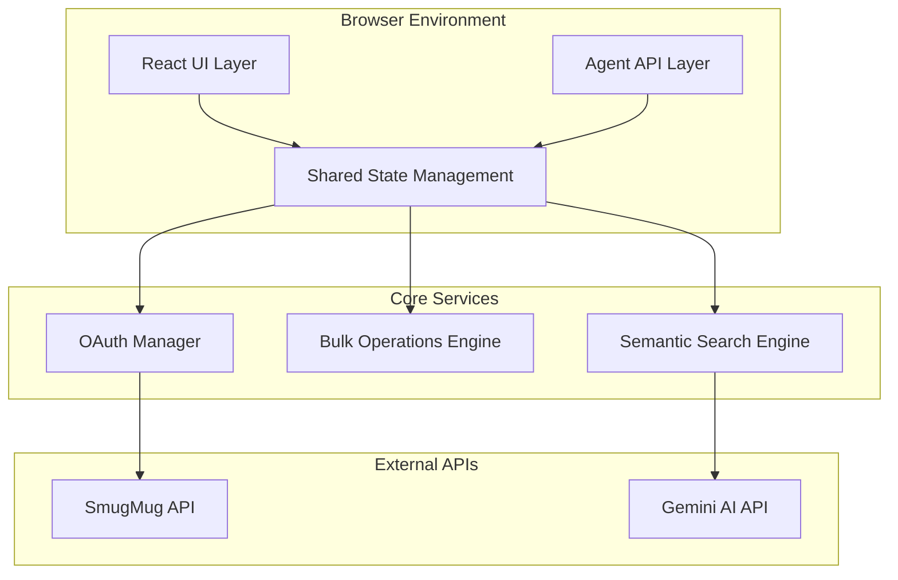
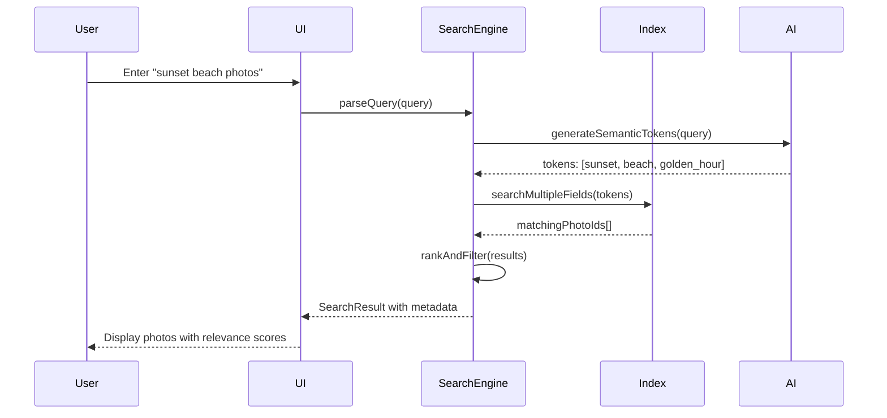
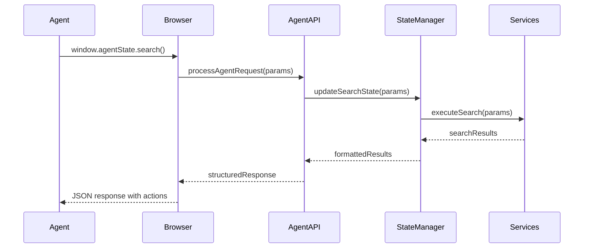

# Technical Architecture

This document describes the technical architecture, design decisions, and system overview of the SmugMug API Reference Application.

## System Overview

The SmugMug API Reference Application is a modern React/TypeScript single-page application designed with **agent-native architecture** - the revolutionary approach of building applications that work seamlessly for both human users and AI agents.

### High-Level Architecture



## Architecture Principles

### 1. **Agent-Native Design**
- **Dual Interface**: Human UI + Programmatic Agent API
- **Structured Data**: Schema.org markup for agent discovery
- **Natural Language**: Command processing for agent interaction
- **Real-time State**: Live updates via `window.agentState`

### 2. **Performance-First**
- **Sub-3-Second Search**: Optimized indexing and caching
- **Memoized Components**: Prevent unnecessary re-renders
- **Virtual Scrolling**: Handle 1000+ photos efficiently
- **Bundle Splitting**: Lazy load features on demand

### 3. **Type Safety**
- **TypeScript Strict Mode**: 100% type coverage
- **Explicit Interfaces**: No `any` types in production
- **Result Pattern**: Consistent error handling
- **Generic Types**: Reusable type-safe components

### 4. **Modular Design**
- **Single Responsibility**: Components <200 lines
- **Composition**: Prefer composition over inheritance
- **Dependency Inversion**: Inject dependencies for testing
- **Clear Boundaries**: Separate concerns across layers

## Core Components

### Frontend Layer (React/TypeScript)

#### **Component Architecture**
```typescript
// Component Hierarchy
App
├── SearchInterface          // Natural language search
├── FilterPanel             // Advanced filtering
├── ResultsGrid             // Photo display with selection
├── BulkOperationsPanel     // Multi-select operations
└── AgentStateProvider      // Agent integration layer
```

#### **State Management**
```typescript
// Centralized state using React Context + Reducers
interface AppState {
  photos: Photo[];
  searchResults: SearchResult[];
  selectedPhotos: string[];
  filters: FilterState;
  bulkOperations: BulkOperationState;
}

// Agent-accessible state
window.agentState = {
  photoSearch: SearchStateProxy,
  bulkOperations: BulkOperationsProxy,
  filters: FilterStateProxy
};
```

### Service Layer

#### **Semantic Search Engine**
```typescript
class SemanticSearchEngine {
  private index: PhotoIndex;
  private fuseInstances: Map<string, Fuse<any>>;
  
  // Core functionality
  async indexPhotos(photos: Photo[]): Promise<void>
  async search(params: SearchParameters): Promise<SearchResult>
  async updateIndex(photo: Photo): Promise<void>
  
  // Performance optimization
  private createSearchableText(photo: Photo): string
  private optimizeIndex(): void
}
```

**Key Features:**
- **Fuzzy Matching**: Typo-tolerant search with Fuse.js
- **Semantic Understanding**: AI-generated metadata integration
- **Multi-field Search**: Objects, scenes, locations, people
- **Performance Indexing**: Sub-3-second response times

#### **Bulk Operations Engine**
```typescript
class BulkOperationExecutor {
  private commandParser: CommandParser;
  private operationHandlers: Map<string, OperationHandler>;
  
  // Core operations
  async execute(operation: BulkOperation): Promise<BulkOperationResult>
  async parseCommand(command: string): Promise<CommandParseResult>
  async rollback(token: string): Promise<RollbackResult>
  
  // Agent integration  
  setContext(context: Record<string, any>): void
  getAvailableOperations(): BulkOperation[]
}
```

**Supported Operations:**
- **Download**: ZIP creation with progress tracking
- **Tagging**: Batch metadata updates
- **Album Management**: Create/update albums
- **Export**: Multiple format support
- **Analysis**: AI-powered batch analysis

#### **OAuth Authentication Manager**
```typescript
class SmugMugAuthManager {
  private tokenStorage: SecureTokenStorage;
  private apiClient: SmugMugAPIClient;
  
  // OAuth 1.0a flow
  async initiateAuth(): Promise<AuthResult>
  async completeAuth(verifier: string): Promise<TokenResult>
  async refreshToken(): Promise<RefreshResult>
  
  // Session management
  async validateSession(): Promise<boolean>
  async logout(): Promise<void>
}
```

## Data Flow Architecture

### Search Flow


### Agent Integration Flow


## Performance Architecture

### Optimization Strategies

#### **1. Rendering Performance**
```typescript
// Component memoization
const PhotoItem = React.memo(({ photo, isSelected, onSelect }) => {
  return (
    <div className="photo-item">
      {/* Optimized rendering */}
    </div>
  );
});

// Expensive computation memoization  
const filteredPhotos = useMemo(() => 
  photos.filter(photo => matchesFilters(photo, filters)),
  [photos, filters]
);

// Event handler memoization
const handlePhotoSelect = useCallback((photoId: string) => {
  setSelectedPhotos(prev => 
    prev.includes(photoId) 
      ? prev.filter(id => id !== photoId)
      : [...prev, photoId]
  );
}, []);
```

#### **2. Search Performance** 
```typescript
// Indexed search with caching
class SearchOptimizer {
  private queryCache = new Map<string, SearchResult>();
  private indexCache = new Map<string, PhotoIndex>();
  
  async optimizedSearch(query: string): Promise<SearchResult> {
    // Check cache first
    if (this.queryCache.has(query)) {
      return this.queryCache.get(query)!;
    }
    
    // Perform search with optimized indexing
    const result = await this.performSearch(query);
    
    // Cache result
    this.queryCache.set(query, result);
    return result;
  }
}
```

#### **3. Memory Management**
```typescript
// Cleanup patterns
useEffect(() => {
  const controller = new AbortController();
  const cleanup = setupEventListeners(controller.signal);
  
  return () => {
    controller.abort();
    cleanup();
  };
}, []);

// Lazy loading for large datasets
const VirtualizedPhotoGrid = lazy(() => import('./VirtualizedPhotoGrid'));
```

## Error Handling Architecture

### Result Pattern Implementation
```typescript
// Consistent error handling across the application
type Result<T, E = Error> = 
  | { success: true; data: T }
  | { success: false; error: E };

// Service layer
async function searchPhotos(query: string): Promise<Result<Photo[]>> {
  try {
    const photos = await searchService.search(query);
    return { success: true, data: photos };
  } catch (error) {
    return { 
      success: false, 
      error: error instanceof Error ? error : new Error('Search failed')
    };
  }
}

// Component layer
const SearchComponent = () => {
  const handleSearch = async (query: string) => {
    const result = await searchPhotos(query);
    
    if (result.success) {
      setPhotos(result.data);
    } else {
      setError(result.error.message);
    }
  };
};
```

### Error Boundaries
```typescript
// Global error boundary
class GlobalErrorBoundary extends Component<Props, State> {
  componentDidCatch(error: Error, errorInfo: ErrorInfo) {
    // Log error to monitoring service
    console.error('Global error:', error, errorInfo);
    
    // Report to error tracking
    this.reportError(error, errorInfo);
  }
  
  render() {
    if (this.state.hasError) {
      return <ErrorFallback onRetry={this.resetError} />;
    }
    
    return this.props.children;
  }
}
```

## Security Architecture

### Authentication Security
- **OAuth 1.0a**: Industry-standard authentication flow
- **Token Storage**: Secure client-side token management
- **HTTPS Only**: All API communications encrypted
- **CORS Configuration**: Proper cross-origin restrictions

### Input Validation
```typescript
// Type-safe input validation
interface SearchRequest {
  query: string;
  limit?: number;
  offset?: number;
}

function validateSearchRequest(input: unknown): Result<SearchRequest> {
  // Runtime validation with type safety
  if (!input || typeof input !== 'object') {
    return { success: false, error: new Error('Invalid input') };
  }
  
  const { query, limit = 50, offset = 0 } = input as any;
  
  if (!query || typeof query !== 'string') {
    return { success: false, error: new Error('Query required') };
  }
  
  return { 
    success: true, 
    data: { query, limit, offset }
  };
}
```

## Deployment Architecture

### Build Process
```typescript
// Vite configuration for optimized builds
export default defineConfig({
  build: {
    rollupOptions: {
      output: {
        manualChunks: {
          vendor: ['react', 'react-dom'],
          search: ['fuse.js'],
          ai: ['@google/genai']
        }
      }
    },
    target: 'es2020',
    minify: 'esbuild'
  },
  optimizeDeps: {
    include: ['react', 'react-dom', 'fuse.js']
  }
});
```

### GitHub Pages Deployment
- **Static Generation**: Pre-built static assets
- **CDN Distribution**: Global edge caching
- **Automatic Deployment**: CI/CD via GitHub Actions
- **Custom Domain Ready**: Configurable for production

## Monitoring & Observability

### Performance Monitoring
```typescript
// Performance tracking
class PerformanceMonitor {
  trackSearchPerformance(query: string, duration: number) {
    performance.mark('search-end');
    performance.measure('search-duration', 'search-start', 'search-end');
    
    // Report to analytics
    this.reportMetric('search_duration', duration, { query });
  }
  
  trackComponentRender(componentName: string) {
    // React DevTools integration
    if (process.env.NODE_ENV === 'development') {
      console.log(`Rendered: ${componentName}`);
    }
  }
}
```

### Error Tracking
- **Client-side Error Capture**: Comprehensive error boundaries
- **Performance Monitoring**: Search latency and render times
- **User Analytics**: Interaction patterns and feature usage

---

## Technology Decisions

### Why React 19.1?
- **Latest Features**: Concurrent rendering and automatic batching
- **Performance**: Improved hydration and streaming
- **Developer Experience**: Better error messages and debugging

### Why TypeScript Strict Mode?
- **Compile-time Safety**: Catch errors before runtime
- **Better IntelliSense**: Enhanced developer productivity  
- **Maintainability**: Self-documenting code with types
- **Refactoring Safety**: Confident large-scale changes

### Why Vite?
- **Fast Development**: Near-instantaneous hot module replacement
- **Optimized Builds**: Tree-shaking and code splitting
- **Modern Standards**: Native ES modules and TypeScript support
- **Plugin Ecosystem**: Rich ecosystem for React development

### Why Agent-Native Architecture?
- **Future-Proofing**: AI agents becoming mainstream
- **Dual Value**: Human UX + AI automation in one application
- **Innovation**: First-mover advantage in agent-compatible design
- **Scalability**: Architecture that grows with AI capabilities

---

**Next Steps:**
- Review [Agent-Native Design](./agent-native-design.md) for AI integration details
- Check [API Design](./api-design.md) for endpoint specifications  
- See [Development Workflow](../development/workflow.md) for contribution guidelines