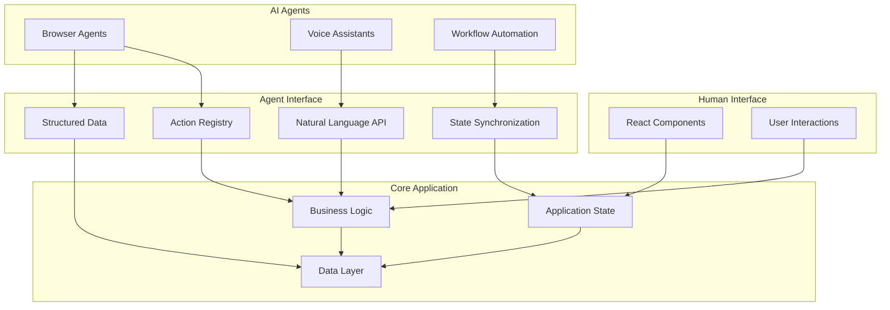

# Agent-Native Architecture Overview

The Agent-Native Architecture represents the third pillar of our AI development methodology - building applications that are designed from the ground up for seamless interaction with AI agents like browser agents, voice assistants, and other automated systems.

## The Three Pillars of AI Development

1. **Building WITH AI**: Using AI agents and tools during development to generate specs, write code, and accelerate workflows
2. **Building AI INTO Applications**: Integrating AI features like smart tagging, content generation, and intelligent automation
3. **Building FOR AI**: Creating applications that AI agents can easily understand, navigate, and interact with

## What Makes an Application Agent-Native?

Agent-native applications expose dual interfaces - one for human users and one for AI agents:

### Human Interface
- Visual components and user-friendly interactions
- Traditional click, tap, and keyboard navigation
- Familiar UI patterns and visual feedback

### Agent Interface  
- Structured data exposure through Schema.org markup
- Programmatic action registry accessible via JavaScript APIs
- Natural language query processing and intent classification
- Real-time state synchronization and event subscriptions

## Core Components

### 1. Structured Data Layer
Export all application data using Schema.org markup that agents can easily parse and understand:

```json
{
  "@context": "https://schema.org",
  "@type": "ImageGallery", 
  "numberOfItems": 150,
  "image": [
    {
      "@type": "Photograph",
      "name": "Sunset over mountains",
      "contentUrl": "https://example.com/sunset.jpg",
      "keywords": ["sunset", "mountains", "landscape"]
    }
  ]
}
```

### 2. Agent Action Registry
Provide programmatic access to all user interactions through a global JavaScript API:

```javascript
// Actions available to agents
window.agentActions = {
  filterPhotos: async (criteria) => { /* implementation */ },
  createAlbum: async (name, photos) => { /* implementation */ },
  searchPhotos: async (query) => { /* implementation */ }
};
```

### 3. Natural Language Processing
Enable agents to interact using natural language queries:

```javascript
// Agent can say: "Show me photos with sunset from 2023"
const query = await window.nlpProcessor.classifyIntent(
  "Show me photos with sunset from 2023"
);
// Returns: { intent: 'filter', parameters: { keywords: ['sunset'], dates: ['2023'] } }
```

### 4. State Synchronization
Provide real-time access to application state for agent awareness:

```javascript
// Agents can subscribe to state changes
window.agentState.subscribe('photo-gallery', (newState) => {
  console.log('Gallery updated:', newState);
});
```

## Benefits of Agent-Native Design

### For Users
- **Accessibility**: Voice and automation support for users with disabilities
- **Efficiency**: Natural language commands for power users
- **Integration**: Seamless workflow integration with other AI tools

### For Developers  
- **Future-Proof**: Ready for the emerging AI-agent ecosystem
- **Standardization**: Consistent patterns using established web standards
- **Debugging**: Rich introspection capabilities for development

### For AI Agents
- **Discovery**: Easy identification of available actions and data
- **Reliability**: Structured, predictable interfaces
- **Context**: Rich metadata for better decision making

## Real-World Use Cases

### Browser Agents (e.g., Gemini-in-Chrome)
- "Find all photos from my vacation and create a slideshow"
- "Tag all sunset photos with 'golden hour' keyword"
- "Export photos matching 'family reunion' to a new album"

### Voice Assistants
- "Hey Assistant, show me my most recent travel photos"
- "Create an album called 'Best of 2023' with my top-rated photos"

### Workflow Automation
- Automated photo organization based on AI analysis
- Batch processing triggered by natural language commands
- Cross-application data synchronization

## Getting Started

Ready to make your application agent-native? Start with our [Implementation Guide](./implementation-guide.md) or try the [Interactive Examples](./interactive-examples.md) to see agent-native patterns in action.

## Architecture Diagram



This dual-interface approach ensures your application works beautifully for both human users and AI agents, creating a truly universal and future-ready user experience.