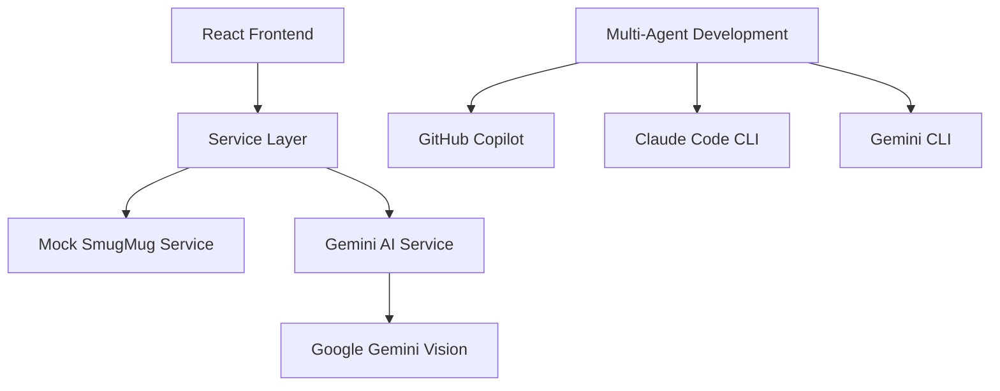

# AI-Powered Development Showcase

Welcome to a comprehensive demonstration of **multi-agent AI development** and **structured AI integration patterns**. This project showcases how to build sophisticated applications using AI-assisted development workflows and reliable AI service integration.

## What This Project Demonstrates

This project showcases three pillars of modern AI development:

### 1. 🔨 Building WITH AI 
**Multi-Agent Development** - Coordinated use of GitHub Copilot, Claude, and Gemini CLI for accelerated development

### 2. 🧠 Building AI INTO Applications
**Structured AI Integration** - Schema-enforced JSON responses for reliable AI services like photo analysis and smart tagging

### 3. 🤖 Building FOR AI
**[Agent-Native Architecture](./agent-native/overview)** - Dual interfaces designed for both human users and AI agents (like Gemini-in-Chrome) to interact seamlessly

This comprehensive approach demonstrates how AI can be integrated at every level of application development.  

## What You're Actually Building

This is a **photo metadata application** that demonstrates:

- **AI photo analysis** using Google Gemini Vision API
- **Batch processing** with rate limiting and error handling  
- **Smart album matching** with confidence scoring
- **Custom instruction processing** for personalized AI behavior
- **Mock service patterns** for development without external dependencies

## Architecture Overview



## Key Innovation: Schema-Enforced AI Responses

Instead of parsing unpredictable text responses, this project uses **structured JSON schemas** to make AI integration reliable:

```typescript
const responseSchema = {
  type: "object",
  properties: {
    title: { type: "string" },
    description: { type: "string" },
    keywords: { type: "array", items: { type: "string" } }
  },
  required: ["title", "description", "keywords"]
};
```

This transforms probabilistic AI outputs into **deterministic, API-like behavior**.

## Quick Navigation

import DocCardList from '@theme/DocCardList';

<DocCardList />

## Current Implementation Status

| Feature | Status | Description |
|---------|--------|-------------|
| **Multi-Agent Workflow** | ✅ Complete | Documented patterns for AI-assisted development |
| **AI Photo Analysis** | ✅ Working | Google Gemini Vision integration with schema enforcement |
| **React Architecture** | ✅ Production-Ready | TypeScript, hooks, service layer, Tailwind CSS |
| **Agent-Native Architecture** | ✅ Complete | Dual interfaces for humans and AI agents with interactive examples |
| **Mock Service Layer** | ✅ Complete | Development patterns without external API dependencies |
| **Batch Processing** | ✅ Working | Rate-limited AI processing with progress tracking |
| **Error Handling** | ✅ Robust | Graceful degradation and retry logic |
| **SmugMug OAuth** | 📋 Reference Only | Implementation guide (requires server-side proxy) |

## Why This Approach Matters

### For Developers
- **Learn proven AI integration patterns** that work in production
- **See multi-agent development in action** with clear role separation
- **Get copy-paste code examples** for your own projects
- **Understand structured AI responses** that eliminate parsing issues

### For Technical Leaders  
- **Evaluate AI-assisted development workflows** with measurable outcomes
- **See engineering excellence** across multiple disciplines
- **Understand production-ready AI patterns** with proper error handling
- **Review architectural decisions** with detailed rationale

## Get Started in 5 Minutes

1. **[Quick Start](./getting-started/quick-start)** - Get the app running locally
2. **[Multi-Agent Workflow](./ai-development/multi-agent-workflow)** - Learn how this was built
3. **[AI Integration Patterns](./implementation/ai-integration)** - Understand the technical approach

---

**This project represents a new approach to AI-assisted development** - treating AI as specialized team members while maintaining engineering rigor and code quality.